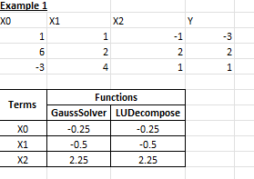

# VBA-Stack
VBA Library for MS Projects

## Overview

This repository contains a collection of VBA subroutines and functions developed for engineering applications. The code is designed to automate calculations and enhance the functionality of Excel spreadsheets used in various engineering tasks.

Most of the VBA functions and subroutines in this repository were utilized in the development of a calculation program for ASME VIII, Div. 1. This program integrates with Power Query (M Language) for efficient data wrangling and analysis.

While the majority of the functions were personally developed, some of the VBA code was contributed by others in the community.

## Purpose

The primary goal of this project is to provide efficient solutions to common engineering problems through the use of VBA. This library can help streamline workflows, improve accuracy, and save time when working with complex data sets.

## Features

- **Data Manipulation:** Functions to clean, transform, and analyze engineering data.
- **Automated Calculations:** Subroutines that perform complex calculations automatically.

## Getting Started

### Prerequisites

To use the code in this repository, you need:
- Microsoft Excel (preferably a version that supports VBA) or MS Office 365
- Basic knowledge of how to access and run VBA code within Excel.

### Installation

1. Clone the repository or download the ZIP file.
2. Open Excel and press `ALT + F11` to access the VBA editor.
3. Import the `.bas` files from this repository into your VBA project.

### Usage

- Each function and subroutine is documented within the code. Refer to the comments for usage instructions.

### Sample Comparison and Output
Here are some examples of the outputs generated by the different modules:

1. **Interpolation Functions**:  
   Files: `AkimaInterpolation.bas`, `CubicSplineInterpolation.bas`, and `PolyInterpolation.bas`  
   

2. **Polynomial Regression**:  
   File: `PolyRegression.bas`  
   

3. **Linear Algebra Solutions**:  
   Files: `LUDecomposition.bas` and `GaussElimination.bas`  
   
   
### More References

The references listed below were not utilized in the development of the functions and subroutines but offer valuable context on alternative techniques:

- [Bicubic Interpolation Code](https://mathformeremortals.wordpress.com/)

